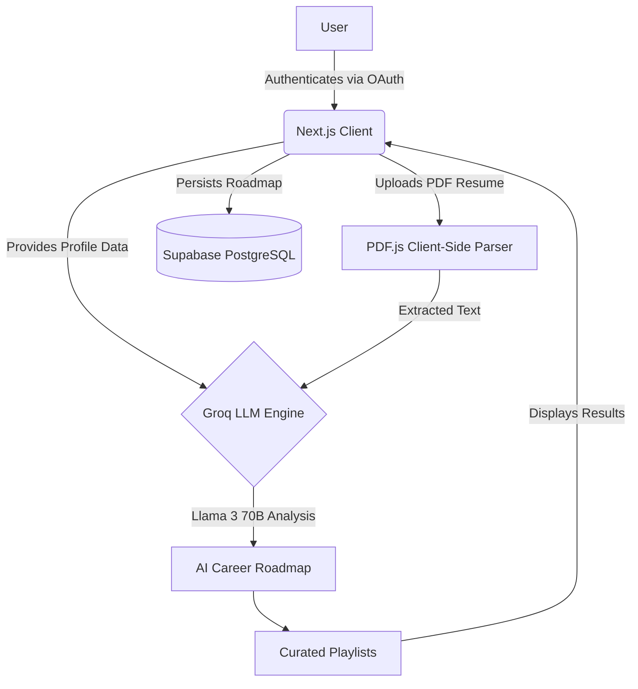

<div align="center">
  <h1>PathFinder</h1>
  <p><b>An AI-Powered Career Discovery & Roadmap Generation Platform</b></p>
  
  <p>🚀 <b>Live Demo:</b> <a href="https://pathfinder-delta-liart.vercel.app">https://pathfinder-delta-liart.vercel.app</a></p>

  <p>
    
    
    
    
    
    
  </p>
</div>

<hr />

## Table of Contents
- [Overview](#overview)
- [Key Features](#key-features)
- [System Architecture](#system-architecture)
- [Project Structure](#project-structure)
- [Getting Started](#getting-started)
- [Testing](#testing)
- [Deployment](#deployment)

---

## Overview

**PathFinder** is a next-generation career discovery platform designed for students and early-career professionals. By leveraging advanced LLM reasoning, it maps individual skills and interests against market realities to generate highly personalized, week-by-week career roadmaps curated with relevant creator playlists.

## Key Features

- **AI-Powered Matching:** Analyzes skills, interests, and timelines using Groq's Llama 3 70B model to recommend strong career paths.
- **Actionable Roadmaps:** Generates specific, step-by-step weekly guides to bridge the gap between current skills and target careers.
- **Curated Playlists:** Integrates directly with YouTube playlists from top tech creators for targeted learning.
- **Intelligent Resume Analysis:** Client-side parsing of PDF resumes to instantly extract skills and professional background securely.

## System Architecture



## Project Structure

```text
PATHFINDER/
├── __tests__/              # Vitest Unit Tests
├── e2e/                    # Playwright E2E Tests
├── src/
│   ├── app/                # Next.js App Router (Pages & API Routes)
│   │   ├── actions/        # Server Actions (Auth, Discovery, Resume)
│   │   └── auth/           # OAuth Callback Handlers
│   ├── components/         # Reusable React Components
│   │   └── ui/             # Core UI primitives
│   ├── lib/                # Utilities & Data
│   └── utils/              # Supabase Client configuration
├── package.json            # Dependencies & Scripts
└── tailwind.config.ts      # Tailwind Configuration
```

## Getting Started

### Prerequisites
- Node.js (v18+)
- A [Supabase](https://supabase.com) project
- A [Groq](https://groq.com) API Key

### Installation

1. **Clone the repository:**
   ```bash
   git clone https://github.com/Harshal844600/PATHFINDER.git
   cd PATHFINDER
   ```

2. **Install dependencies:**
   ```bash
   npm install
   ```

3. **Configure environment variables:**
   Create a `.env.local` file in the root directory:
   ```env
   NEXT_PUBLIC_SUPABASE_URL=your_supabase_url
   NEXT_PUBLIC_SUPABASE_ANON_KEY=your_supabase_anon_key
   GROQ_API_KEY=your_groq_api_key
   NEXT_PUBLIC_SITE_URL=http://localhost:3000
   ```

4. **Run the development server:**
   ```bash
   npm run dev
   ```

## Testing

The project is maintained with a comprehensive testing suite.

```bash
# Run Unit & Component Tests (Vitest)
npm run test

# Run End-to-End Auth Flows (Playwright)
npm run test:e2e
```

## Deployment

This project is optimized for deployment on **Vercel**. 

1. Push your code to your GitHub repository.
2. Import the project into Vercel.
3. Configure the environment variables (`NEXT_PUBLIC_SUPABASE_URL`, etc.).
4. Set your production domain as `NEXT_PUBLIC_SITE_URL`.
5. Deploy.

> **Note:** Ensure that your Authorized JavaScript origins and Redirect URIs in your Google Cloud Console and Supabase Dashboard are updated with your live Vercel URL.
